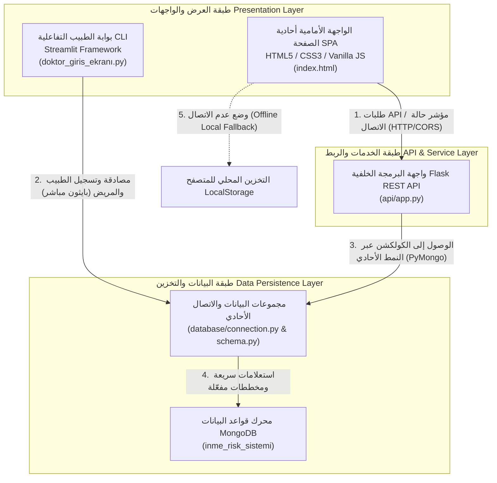

# 🧠 موسوعة النظام الذكي لمتابعة المرضى وتحليل مخاطر السكتة الدماغية (İnme Risk Sistemi Wiki)

> **وثيقة أكاديمية، تقنية، وسريرية شاملة ومهنية مرجعية**
> 
> * **اسم المشروع بالتركية**: Akıllı Hasta Takip Sistemi Projesi (İnme Risk Analiz Sistemi)
> * **بيئة التطوير والاعتماد**: جامعة الفرات، قسم هندسة البرمجيات (Fırat Üniversitesi Yazılım Mühendisliği)
> * **لغة الوثيقة**: العربية الفصحى الأكاديمية (الرسمية)
> * **سنة الإصدار**: 2026
> * **حالة المستند**: جاهز للإنتاج سريرياً وتقنياً (Production-Ready) ✅

---

## 📖 جدول المحتويات (Table of Contents)
1. [الفصل الأول: المقدمة والأبعاد الطبية الحيوية والسريرية](#1-الفصل-الأول-المقدمة-والأبعاد-الطبية-الحيوية-والسريرية)
2. [الفصل الثاني: البنية التحتية وهندسة البرمجيات الكلية والدقيقة](#2-الفصل-الثاني-البنية-التحتية-وهندسة-البرمجيات-الكلية-والدقيقة)
3. [الفصل الثالث: هندسة الذكاء الاصطناعي والرياضيات السريرية الهجينة](#3-الفصل-الثالث-هندسة-الذكاء-الاصطناعي-والرياضيات-السريرية-الهجينة)
4. [الفصل الرابع: النمذجة الدقيقة وتصميم قاعدة بيانات MongoDB](#4-الفصل-الرابع-النمذجة-الدقيقة-وتصميم-قاعدة-بيانات-mongodb)
5. [الفصل الخامس: الدليل المرجعي الكامل لواجهات REST API](#5-الفصل-الخامس-الدليل-المرجعي-الكامل-لواجهات-rest-api)
6. [الفصل السادس: دليل التثبيت، التهيئة، والتشغيل الفني](#6-الفصل-السادس-دليل-التثبيت-التهيئة-والتشغيل-الفني)
7. [الفصل السابع: حوكمة المشروع وفريق العمل وسجل التقدم الأسبوعي](#7-الفصل-السابع-حوكمة-المشروع-وفريق-العمل-وسجل-التقدم-الأسبوعي)

---

## 1. الفصل الأول: المقدمة والأبعاد الطبية الحيوية والسريرية

### 1.1 المشكلة الطبية الحيوية وأثر السكتة الدماغية (Stroke Pathophysiology)
تعد السكتة الدماغية (Apoplexy / Stroke) أحد الأسباب الرئيسية للوفيات والعجز الدائم عالمياً. تنقسم السكتة الدماغية فسيولوجياً إلى نوعين رئيسيين:
1. **السكتة الدماغية الإقفارية (Ischemic Stroke)**: تشكل حوالي 87% من الحالات، وتنتج عن انسداد الشرايين المؤدية للدماغ بفعل خثرة دموية (Thrombus) أو صمة (Embolus)، مما يحرم الخلايا العصبية من الأكسجين والجلوكوز ويؤدي لموتها السريع.
2. **السكتة الدماغية النزفية (Hemorrhagic Stroke)**: تنتج عن تمزق وعاء دموي داخل الدماغ (Intracerebral) أو في الحيز تحت العنكبوتية (Subarachnoid)، غالباً بسبب تمدد الأوعية الدموية (Aneurysm) أو فرط ضغط الدم المزمن غير المنضبط.

تكمن الصعوبة السريرية في أن عوامل الخطورة لا تعمل بشكل منفصل، بل تتداخل وتتفاقم تأثيراتها بشكل تراكمي معقد يصعب على العين البشرية المجردة تقديره كمياً بدقة متناهية فور دخول المريض للعيادة.

### 1.2 عوامل الخطورة السريرية والديموغرافية وعلاقاتها التبادلية
تتم دراسة وتحليل عدد من المتغيرات الفيزيولوجية والسلوكية لتحديد مستوى الخطر بدقة:

| عامل الخطورة السريري | التأثير الفسيولوجي المباشر | الأهمية الطبية في التنبؤ |
| :--- | :--- | :--- |
| **فرط ضغط الدم (Hipertansiyon)** | يسبب تصلب الشرايين (Atherosclerosis) وتلف الجدران المبطنة للأوعية الدموية الدقيقة، مما يسهل تشكل الجلطات أو تمزق الأوعية. | العامل الأهم القابل للتعديل؛ يضاعف احتمالية الإصابة بالسكتة الدماغية بمقدار مرتين إلى أربع مرات. |
| **مرض السكري (Ortalama Şeker)** | يؤدي فرط سكر الدم المزمن إلى التحلل السكري غير الإنزيمي للبروتينات وتراكم النواتج النهائية المتقدمة للغلوكوز (AGEs) في جدران الشرايين. | يزيد احتمالية الإصابة بـ 1.5 إلى 3 أضعاف، ويزيد من خطورة تلف الخلايا الدماغية أثناء الحادث الإقفاري. |
| **مؤشر كتلة الجسم (BMI)** | يرتبط بمتلازمة التمثيل الغذائي (Metabolic Syndrome)، وارتفاع معدل الدهون الثلاثية، وانقطاع النفس الانسدادي أثناء النوم. | مؤشر غير مباشر على زيادة العبء القلبي الوعائي والالتهابات الجهازية المزمنة. |
| **التقدم في السن (Yaş)** | فقدان الشرايين لمرونتها الطبيعية وتراكم اللويحات الدهنية بمرور الزمن. | يرتفع معدل الخطر بشكل أسي لكل عقد بعد سن 55 عاماً. |
| **سلوك التدخين (Sigara)** | يزيد النيكوتين من تشنج الأوعية ومعدل ضربات القلب، بينما يقلل أحادي أكسيد الكربون من قدرة الهيموغلوبين على حمل الأكسجين. | يرفع لزوجة الدم وتجمع الصفائح الدموية، مما يضاعف خطر السكتة الدماغية بمقدار مرتين. |

### 1.3 أهداف النظام ومفهوم أداة القرار السريري المساندة (CDSS)
يهدف **Akıllı Hasta Takip Sistemi** إلى حل هذه المعضلات الطبية من خلال:
* **التنبؤ الوقائي والمبكر**: الانتقال من رد الفعل السريري (علاج السكتة بعد وقوعها) إلى الفعل الوقائي التنبؤي (حساب الاحتمالية بدقة فائقة وتداركها).
* **دعم القرار الطبي المساند (CDSS)**: تمكين الطبيب في العيادة من إدخال البيانات البيومترية والسلوكية الفورية للمريض والحصول على تحليل إحصائي سريري موثق يوضح مستوى الخطورة، مصحوباً بتوصيات سريرية موجهة متعددة التخصصات الطبية لتخفيض الخطر.

---

## 2. الفصل الثاني: البنية التحتية وهندسة البرمجيات الكلية والدقيقة

تبنى بنية النظام الهندسية على نمط **الهندسة ثلاثية الطبقات (3-Tier Architecture)** المتكامل مع ميزات فريدة تدعم التشغيل المزدوج لتقديم أقصى درجات التوافرية والاستقرار الطبي في بيئات الرعاية الصحية الحرجة.

### 2.1 بنية الطبقات الثلاث (Macro 3-Tier Architecture)



#### 1. طبقة العرض والواجهات (Presentation Layer)
* **واجهة الـ SPA المتطورة (`frontend/index.html`)**: واجهة ويب أحادية الصفحة، مصممة بطراز النيومورفيزم الزجاجي (Glassmorphism) المتوافق مع شاشات الأجهزة الطبية المختلفة. تدعم واجهة الـ SPA نمطين للعمل:
  * **النمط المتصل (Online Mode)**: تتخاطب مباشرة مع Flask REST API لتشغيل نموذج التنبؤ السريري الهجين وحفظ النتائج في خادم MongoDB المركزي.
  * **النمط غير المتصل (Offline Local Fallback Mode)**: في حال انقطاع الشبكة أو توقف خادم الـ API، تتحول الواجهة تلقائياً وبسلاسة تامة إلى "الوضع المحلي". تعتمد في هذا الوضع على تخزين بيانات الأطباء في الذاكرة المحلية للمتصفح (`LocalStorage`)، وتقوم بتقدير درجة الخطورة عبر خوارزمية Framingham المحلية لضمان عدم توقف الخدمة الطبية بأي حال من الأحوال.
* **بوابة الطبيب التفاعلية المستقلة (`doktor_giris_ekranı.py`)**: مبنية بالكامل باستخدام إطار عمل `Streamlit`. تمثل لوحة التحكم الإدارية الخاصة بالأطباء وتتكامل مع مكتبات التشفير السحابي لتأمين جلسات الاستخدام (Session State Management).

#### 2. طبقة الخدمات والربط (Service Layer - REST API)
* تم بناء الواجهة الخلفية باستخدام إطار عمل `Flask` الخفيف والمرن. تقوم الواجهة بتنظيم حركة البيانات بين الطلبات القادمة من المتصفح وقاعدة البيانات، مع تطبيق بروتوكولات حماية الموارد ومشاركة الأصول عبر النطاقات المختلفة (CORS - Cross-Origin Resource Sharing).

#### 3. طبقة البيانات والتخزين (Data & Persistence Layer)
* تم استخدام محرك **MongoDB** غير العلاقي كقاعدة بيانات مركزية للمشروع. يتم الوصول إليها عبر مكتبة `PyMongo`.
* **تصميم الاتصال الأحادي (Singleton Connection Pattern)**:
  لمنع حدوث ظاهرة تسريب قنوات الاتصال (Connection Leakage) واستهلاك الذاكرة العشوائية للخادم الطبي، تم تطبيق نمط التصميم الأحادي (Singleton Pattern) في ملف [connection.py](file:///c:/Users/user/Desktop/333/database/connection.py). يتم الاحتفاظ بكائن العميل `_client` كمتغير عالمي خاص يتم إنشاؤه لمرة واحدة فقط وإعادة استخدامه في كافة العمليات اللاحقة، مع آلية فحص مدمجة لمدى فاعلية وقدرة استجابة الخادم عن طريق إرسال نبضات فحص دورية (Ping Command).

---

## 3. الفصل الثالث: هندسة الذكاء الاصطناعي والرياضيات السريرية الهجينة

يعد نموذج الذكاء الاصطناعي قلب النظام النابض، حيث يمزج بين دقة التعلم الإحصائي والخبرة السريرية الطبية المثبتة سريرياً عبر التاريخ الطبي.

### 3.1 هندسة البيانات ومعالجة عدم الاتزان (SMOTE Techniques)
* **البيانات المصدرية**: تم استخدام قاعدة بيانات سريرية موثقة تم تنظيفها ومعالجتها مسبقاً (`temizlenmis_hasta_verisi.csv`)، وتضم **5111 حالة** و**12 متغيراً حيوياً ديموغرافياً**.
* **مشكلة عدم توازن العينات (Class Imbalance Problem)**: 
  تعد هذه المشكلة أحد أكبر التحديات في القواعد الطبية، حيث إن الغالبية العظمى من السجلات تكون لأفراد أصحاء ونسبة ضئيلة جداً لمرضى أصيبوا بسكتة دماغية فعلياً. إذا تم تدريب النموذج على هذه البيانات مباشرة، فإنه سيتعلم الانحياز للأغلبية (الأصحاء) ويفشل في اكتشاف المريض المعرض للخطر (Recall منخفض جداً).
* **الحل الإحصائي**: تم دمج تقنية **SMOTE** (Synthetic Minority Over-sampling Technique) في خط التدريب [train.py](file:///c:/Users/user/Desktop/333/model/train.py). تعمل الخوارزمية في الفضاء الهندسي متعدد الأبعاد للميزات على حساب أقرب جيران العينات القليلة (k-nearest neighbors) وتوليد عينات اصطناعية جديدة ذكية بينها (بين السجلات الإيجابية للسكتة الدماغية)، مما يحقق اتزاناً إحصائياً دقيقاً بنسبة 50% إلى 50% لنموذج التدريب دون تكرار للبيانات (Overfitting).

### 3.2 خوارزمية التصنيف المعتمدة وتقييم الأداء (Gradient Boosting Classifier)
تم اعتماد خوارزمية **Gradient Boosting Classifier** كنواة تنبؤية بعد إجراء مقارنات شاملة وتعديل دقيق للمعلمات الفائقة (Hyperparameters).

* **معلمات النموذج (Model Hyperparameters)**:
  * `n_estimators = 300`: عدد أشجار القرار التتابعية للحد من الانحراف والتباين.
  * `learning_rate = 0.05`: معدل تقلص المساهمة الفردية لكل شجرة لتحقيق استقرار التقارب.
  * `max_depth = 4`: تحديد عمق الأشجار لمنع الإفراط في الملاءمة.
  * `subsample = 0.8`: استخدام 80% من العينات لتدريب كل شجرة لإضافة طابع عشوائي يحسن القدرة التعميمية للنموذج.
* **التحقق التقاطعي الطبقي (Stratified K-Fold Cross-Validation)**:
  لضمان قوة استقرار النموذج وتجنب التحيز، تم إخضاع خط التدريب لتقييم تقاطعي خماسي الطبقات ($K=5$)، مما يضمن تدريب واختبار النموذج على جميع أجزاء البيانات بشكل متوازن والحفاظ على ثبات التنبؤ.

### 3.3 نموذج الدمج السريري الهجين المبتكر (Framingham-GBM Hybrid Model)

> [!IMPORTANT]
> **الابتكار التقني الطبي الفريد للمشروع**
> تواجه نماذج الذكاء الاصطناعي البحتة المدربة إحصائياً على قواعد البيانات الطبية مشكلة تسمى "التحيز الإحصائي للسن" (Age Bias). نظراً لأن الفئات المتقدمة في السن هي الأكثر تسجيلاً لإصابات السكتة الدماغية تاريخياً، فإن النموذج الإحصائي الصرف يميل تلقائياً إلى تصنيف كبار السن الأصحاء كـ "مرتفع الخطورة" حتى لو كانت فحوصاتهم سليمة تماماً، وفي المقابل قد يغفل عن فئة الشباب والبالغين الذين يمتلكون عوامل خطورة حرجة كفرط ضغط الدم والسكري والسمنة مجتمعة.
> 
> لحل هذه العقبة العلمية، تم تصميم نموذج هجين يدمج بين **تقدير الخطورة الإحصائي للذكاء الاصطناعي (GBM)** و**مقياس Framingham السريري القائم على الأدلة الطبية الراسخة**.

يتم احتساب درجة الخطورة الكلية عبر الصيغة الرياضية المركبة التالية في ملف [predict.py](file:///c:/Users/user/Desktop/333/model/predict.py):

$$\text{Final Risk Score} = \min\left(0.95, \, 0.70 \times \text{Klinik Skor (Framingham)} + 0.30 \times \text{ML Prob (Gradient Boosting)}\right)$$

حيث يتم حساب **الخطورة السريرية (Klinik Skor)** بناءً على أوزان سريرية محددة بدقة بالغة:
1. **الخطورة الأساسية المرتبطة بالسن (Age Base Risk)**:
   * سن أقل من 35: $0.01$
   * سن من 35 إلى 44: $0.03$
   * سن من 45 إلى 54: $0.06$
   * سن من 55 إلى 64: $0.10$
   * سن من 65 إلى 74: $0.20$
   * سن 75 فما فوق: $0.38$
2. **عوامل الخطورة التراكمية المضافة (Independent Risk Contributors)**:
   * وجود فرط ضغط دم نشط (Hipertansiyon): $+0.18$
   * وجود تاريخ لمرض قلبي وعائي (Kalp Hastalığı): $+0.28$
   * سلوك تدخين نشط (Halen İçiyor): $+0.15$
   * سلوك تدخين سابق (Eski İçici): $+0.05$
   * قراءة السكر العشوائي الحرج $\ge 250\text{ mg/dL}$: $+0.15$
   * قراءة السكر المرتفع $\ge 180\text{ mg/dL}$: $+0.10$
   * قراءة السكر ما فوق الطبيعي $\ge 130\text{ mg/dL}$: $+0.05$
   * قراءة السمنة المفرطة الحادة $\text{BMI} \ge 40$: $+0.08$
   * قراءة السمنة المرتفعة $\text{BMI} \ge 35$: $+0.06$
   * قراءة زيادة الوزن النشطة $\text{BMI} \ge 30$: $+0.03$
   * عامل جنس الذكور الأقل من سن 70 عاماً: $+0.03$

يتم دمج هذه القيم في معادلة فسيولوجية لمنع تجاوز القيمة القصوى النظرية المحددة بـ $0.95$ عبر الآلية التالية:
$$\text{Klinik Skor} = \text{Base} + (1.0 - \text{Base}) \times \sum \text{Faktorler}$$

### 3.4 محرك التوصيات السريرية التفاعلي ومستويات الخطورة
يتم تصنيف النتيجة النهائية للخطورة إلى ثلاثة مستويات تشغيلية ينبثق عنها نصائح طبية موجهة:

```
[0.00] ───────────── [0.10] ────────────────────── [0.30] ─────────────────────── [1.00]
         منخفضة                  متوسطة                           مرتفعة
     Rutin Kontrol          Öncelikli Sevk                     ACİL Müdahale
     (Rutin / Green)       (Öncelikli / Orange)               (ACİL / Red)
```

* **منخفضة (Düşük الخطورة < 10% - لون أخضر #22c55e)**:
  * *التوجيه السريري*: مراجعة طبيب الأسرة دورياً.
  * *نمط الحياة*: الاستمرار في الأنشطة الرياضية بمعدل 150 دقيقة أسبوعياً واتباع حمية البحر المتوسط الغذائية.
* **متوسطة (Orta الخطورة 10% - 30% - لون برتقالي #f59e0b)**:
  * *التوجيه السريري*: التوصية بإجراء استشارة طبية متخصصة (عيادة القلب أو عيادة الغدد والأعصاب) خلال 30 يوماً.
  * *نمط الحياة*: تقليل استهلاك الأملاح اليومية لأقل من 5 غرام، وبدء حمية منظمة لتخفيض الوزن وإيقاف التدخين بشكل حاسم وفوري.
* **مرتفعة (Yüksek الخطورة > 30% - لون أحمر #ef4444)**:
  * *التوجيه السريري*: استدعاء عاجل لاستشارة أخصائي أمراض الأعصاب والقلب خلال هذا الأسبوع لفحص إمكانية صرف مميعات ومضادات تخثر احترازية.
  * *نمط الحياة*: مراقبة يومية لضغط الدم صباحاً ومساءً، تثقيف المريض حول أعراض السكتة الدماغية الطارئة (خدر الوجه، ضعف الذراع، صعوبة النطق - FAST) والاتصال فوراً بالطوارئ 112 عند ظهورها.

---

## 4. الفصل الرابع: النمذجة الدقيقة وتصميم قاعدة بيانات MongoDB

تم تصميم قاعدة بيانات MongoDB لتلائم المتطلبات السريرية المعقدة وسرعة الوصول التنبؤي، مع تفعيل آليات التحقق من صحة البيانات (JSON Schema Validation) مباشرة في النواة.

### 4.1 هياكل ومخططات مجموعات البيانات (JSON Schemas)

#### 1. مجموعة الأطباء (`doktorlar`)
تحتفظ بحسابات وبيانات الأطباء والمصادقة الأمنية المشفرة بـ `SHA-256`.

```json
{
  "$jsonSchema": {
    "bsonType": "object",
    "required": ["doktor_id", "ad", "soyad", "uzmanlik"],
    "properties": {
      "doktor_id": {
        "bsonType": "string",
        "description": "المعرف الفريد للطبيب بتنسيق DR-XXXXX"
      },
      "ad": { "bsonType": "string" },
      "soyad": { "bsonType": "string" },
      "uzmanlik": { 
        "bsonType": "string",
        "description": "التخصص الطبي للطبيب (مثال: Nöroloji, Kardiyoloji)" 
      },
      "email": { "bsonType": "string" },
      "sifre_hash": { 
        "bsonType": "string", 
        "description": "كلمة المرور مشفرة بخوارزمية SHA-256 محلياً قبل التخزين" 
      },
      "guvenlik_sorusu": { "bsonType": "string" },
      "guvenlik_cevabi_hash": { "bsonType": "string" },
      "aktif": { "bsonType": "bool" },
      "kayit_tarihi": { "bsonType": "date" },
      "son_giris": { "bsonType": "date" },
      "giris_sayisi": { "bsonType": "int" }
    }
  }
}
```

#### 2. مجموعة المرضى (`hastalar`)
سجلات البيانات الشخصية والديموغرافية الأساسية للمرضى الخاضعين للمتابعة.

```json
{
  "$jsonSchema": {
    "bsonType": "object",
    "required": ["hasta_id", "ad", "soyad", "yas", "cinsiyet"],
    "properties": {
      "hasta_id": {
        "bsonType": "string",
        "description": "المعرف السريري الموحد للمريض بتنسيق HS-XXXXX"
      },
      "ad": { "bsonType": "string" },
      "soyad": { "bsonType": "string" },
      "yas": {
        "bsonType": "int",
        "minimum": 0,
        "maximum": 130,
        "description": "عمر المريض بالسنوات"
      },
      "cinsiyet": {
        "enum": ["Erkek", "Kadın"],
        "description": "الجنس البيولوجي المعتمد للنموذج السريري"
      },
      "telefon": { "bsonType": "string" },
      "email": { "bsonType": "string" },
      "kayit_tarihi": { "bsonType": "date" },
      "aktif": { "bsonType": "bool" }
    }
  }
}
```

#### 3. مجموعة التقييمات السريرية والزيارات الطبية (`tibbi_bilgiler`)
تسجيل المؤشرات الفيزيولوجية للمريض خلال الزيارات وتفاصيل الوصفات الطبية.

```json
{
  "$jsonSchema": {
    "bsonType": "object",
    "required": ["kayit_id", "hasta_id", "muayene_tarihi"],
    "properties": {
      "kayit_id": { "bsonType": "string", "description": "معرف الزيارة الفريد TK-XXXXX" },
      "hasta_id": { "bsonType": "string", "description": "المفتاح الأجنبي المرتبط بالمريض" },
      "doktor_id": { "bsonType": "string", "description": "معرف الطبيب الذي أجرى الكشف" },
      "muayene_tarihi": { "bsonType": "date" },
      "hipertansiyon": { "bsonType": "int", "enum": [0, 1] },
      "kalp_hastaligi": { "bsonType": "int", "enum": [0, 1] },
      "ortalama_seker": { 
        "bsonType": "double", 
        "minimum": 0.0,
        "description": "معدل السكر في الدم مقاساً بـ mg/dL" 
      },
      "vucut_kitle_indeksi": { 
        "bsonType": "double", 
        "minimum": 0.0,
        "description": "مؤشر كتلة الجسم BMI kg/m2" 
      },
      "sikayet": { "bsonType": "string" },
      "tani_notu": { "bsonType": "string" },
      "ilac_recetesi": {
        "bsonType": "array",
        "description": "قائمة الأدوية الموصوفة مضمنة مباشرة كـ Embedded Document لمنع التكرار"
      },
      "olusturma_tarihi": { "bsonType": "date" }
    }
  }
}
```

#### 4. مجموعة نمط الحياة والسلوكيات (`yasam_tarzi`)
تحتفظ بالبيانات السلوكية والبيئية غير الطبية المرتبطة ارتباطاً مباشراً بمخاطر السكتة.

```json
{
  "$jsonSchema": {
    "bsonType": "object",
    "required": ["hasta_id"],
    "properties": {
      "hasta_id": { "bsonType": "string", "description": "معرف المريض الفريد (1:1 علاقة)" },
      "evli_mi": { "enum": ["Evet", "Hayır", "Eski", "Hiç"] },
      "calisma_tipi": { 
        "enum": ["Özel Sektör", "Kamu", "Serbest Meslek", "Emekli", "Öğrenci", "İşsiz", "Çocuk"] 
      },
      "ikamet_tipi": { "enum": ["Kentsel", "Kırsal"] },
      "sigara_durumu": { "enum": ["Hiç İçmedi", "Eski İçici", "Halen İçiyor"] },
      "guncelleme_tarihi": { "bsonType": "date" }
    }
  }
}
```

#### 5. مجموعة سجلات التنبؤ وحفظ درجات الخطورة (`inme_risk_tahminleri`)
الأرشيف السريري لكافة عمليات حساب الخطورة وقيم المدخلات والتوصيات الناتجة.

```json
{
  "$jsonSchema": {
    "bsonType": "object",
    "required": ["tahmin_id", "hasta_id", "risk_skoru", "risk_seviyesi", "tahmin_tarihi"],
    "properties": {
      "tahmin_id": { "bsonType": "string", "description": "معرف التنبؤ السريري الفريد RT-XXXXX" },
      "hasta_id": { "bsonType": "string" },
      "doktor_id": { "bsonType": "string" },
      "model_surumu": { "bsonType": "string", "description": "إصدار النموذج وعوامل الوزن" },
      "risk_skoru": { "bsonType": "double", "minimum": 0.0, "maximum": 1.0 },
      "risk_yuzdesi": { "bsonType": "double" },
      "risk_seviyesi": { "enum": ["Düşük", "Orta", "Yüksek"] },
      "model_girdileri": { "bsonType": "object", "description": "لقطة كاملة لقيم المتغيرات وقت الحساب (Snapshot)" },
      "oneriler": { "bsonType": "array" },
      "tahmin_tarihi": { "bsonType": "date" },
      "doktor_notu": { "bsonType": "string" },
      "onay_durumu": { "enum": ["Beklemede", "Onaylandı", "Reddedildi"] }
    }
  }
}
```

#### 6. مجموعة تدقيق وسجلات التغيير لامتثال الخصوصية الطبية (`yasam_tarzi_degisiklikleri`)
تعتمد لوائح الحماية الطبية العالمية (GDPR / KVKK) ضرورة رصد وتدقيق أي تعديل في السلوكيات الحيوية والطبية للمريض لضمان الأمان وسلامة البيانات.

```json
{
  "bsonType": "object",
  "required": ["hasta_id", "degisiklik_turu", "eski_deger", "yeni_deger", "degisiklik_tarihi"],
  "properties": {
    "hasta_id": { "bsonType": "string" },
    "degisiklik_turu": { "bsonType": "string", "description": "اسم الحقل المعدل (مثال: sigara_durumu)" },
    "eski_deger": { "bsonType": "string" },
    "yeni_deger": { "bsonType": "string" },
    "degisiklik_tarihi": { "bsonType": "date" },
    "doktor_id": { "bsonType": "string", "description": "معرف الطبيب المسؤول عن التعديل" }
  }
}
```

### 4.2 استراتيجية الفهارس وبنية السرعة والأداء (MongoDB Indexing)
لتحقيق أداء متميز وتقليل زمن الاستعلام (Query Latency) تحت ظروف ضغط العيادات الطبية، تم تنفيذ بنية الفهارس التالية:

1. **الفهارس الفريدة الأساسية (Unique Indexes)**:
   * تفعيل الفهرسة الفريدة على المعرفات: `doktor_id_unique` لمجموعة الأطباء، `hasta_id_unique` لمجموعة المرضى، و `kayit_id_unique` لمجموعة التقييمات السريرية. يضمن ذلك حماية البيانات السريرية من التكرار والخلط على مستوى النواة.
2. **الفهارس المركبة للأبحاث والبحث السريع (Compound Indexes)**:
   * **فهرس البحث الديموغرافي السريع**: فهرس مركب على حقول الاسم واللقب `[("ad", ASCENDING), ("soyad", ASCENDING)]` بمجموعة المرضى لتسهيل الوصول الفوري لملف المريض برمجياً.
   * **فهرس الخط الزمني الطبي للمريض**: فهرس مركب في مجموعة التقييمات السريرية `[("hasta_id", ASCENDING), ("muayene_tarihi", DESCENDING)]`. يتيح جلب المسار الطبي التاريخي لأي مريض وترتيبه تنازلياً من الأحدث للأقدم في أجزاء من الملي ثانية.
   * **فهرس مراقبة وتحليل التنبؤات**: فهرس مركب في سجلات المخاطر `[("hasta_id", ASCENDING), ("tahmin_tarihi", DESCENDING)]` لتتبع فاعلية العلاجات والوقاية.
3. **الفهارس السلوكية السريعة**:
   * فهرسة حقل `risk_seviyesi` و `risk_skoru` لتمكين لوحة التحكم من فرز وتصنيف المرضى ذوي الحالات الحرجة فوراً ووضعهم في صدارة اهتمام الكادر الطبي.

### 4.3 استراتيجية النسخ الاحتياطي والصيانة الدورية للمستشفيات
لحماية السجلات الطبية الحساسة وضمان استمرارية التشغيل، يُنصح بتفعيل الآليات التالية:
* **النسخ الاحتياطي الساخن المجدول (Daily Hot Backup)**:
  تنفيذ أمر النسخ المؤرشف المضغوط يومياً في تمام الساعة 02:00 صباحاً عبر Cron Job:
  ```bash
  mongodump --uri "mongodb://localhost:27017/inme_risk_sistemi" --archive=/backup/daily/db_backup_$(date +%F).gz --gzip
  ```
* **آلية الاسترجاع السريع للكوارث (Disaster Recovery)**:
  ```bash
  mongorestore --uri "mongodb://localhost:27017/inme_risk_sistemi" --archive=/backup/daily/db_backup_target.gz --gzip --drop
  ```

---

## 5. الفصل الخامس: الدليل المرجعي الكامل لواجهات REST API

تم تصميم واجهات البرمجة الخلفية (Flask Backend REST API) لتكون متوافقة بالكامل مع بروتوكولات RESTful القياسية، وتقدم استجابات بنسق مفصل وموحد لخدمة الواجهات المختلفة.

### 5.1 توثيق نقاط النهاية البرمجية بالتفصيل الكامل (REST Endpoints)

#### 1. إضافة مريض جديد وعقد السجل
* **المسار**: `POST /api/hastalar`
* **محتوى الطلب (Request Body - JSON)**:
  ```json
  {
    "ad": "Mustafa",
    "soyad": "HACCAR",
    "yas": 48,
    "cinsiyet": "Erkek",
    "telefon": "05559876543",
    "email": "mustafa.haccar@email.com"
  }
  ```
* **الاستجابة الناجحة (201 Created)**:
  ```json
  {
    "durum": "basarili",
    "hasta_id": "HS-05112",
    "mesaj": "Hasta başarıyla eklendi."
  }
  ```
* **الأخطاء المتوقعة (HTTP Codes)**:
  * `400 Bad Request`: نقص البيانات الإلزامية مثل (ad, soyad, yas).

#### 2. الاستعلام السريع والبحث عن المرضى
* **المسار**: `GET /api/hastalar/ara`
* **المعلمات (Query Parameters)**: `?ad=Mustafa&soyad=HACCAR`
* **الاستجابة الناجحة (200 OK)**:
  ```json
  {
    "durum": "basarili",
    "hastalar": [
      {
        "hasta_id": "HS-05112",
        "ad": "Mustafa",
        "soyad": "HACCAR",
        "yas": 48,
        "cinsiyet": "Erkek",
        "telefon": "05559876543",
        "email": "mustafa.haccar@email.com",
        "kayit_tarihi": "2026-05-17T23:50:00"
      }
    ]
  }
  ```

#### 3. فحص مصادقة وتسجيل دخول الطبيب
* **المسار**: `POST /api/doktorlar/login`
* **محتوى الطلب (Request Body - JSON)**:
  ```json
  {
    "tc_no": "12345678901",
    "password": "sifre123"
  }
  ```
* **الاستجابة الناجحة (200 OK)**:
  ```json
  {
    "durum": "basarili",
    "doktor": {
      "doktor_id": "DR-00001",
      "tc_no": "12345678901",
      "ad": "Fatma",
      "soyad": "KAYA",
      "uzmanlik": "Nöroloji",
      "email": "fatma.kaya@hastane.com",
      "kayit_tarihi": "2025-01-10T00:00:00",
      "giris_sayisi": 6
    }
  }
  ```
* **الأخطاء المتوقعة (HTTP Codes)**:
  * `400 Bad Request`: نقص إرسال المدخلات المباشرة.
  * `401 Unauthorized`: في حال تطابق الـ TC ولكن كلمة المرور غير صحيحة سريرياً.
  * `404 Not Found`: عدم وجود سجل للطبيب المعني بالرقم المدخل.

#### 4. حساب الخطورة والتنبؤ السريري الهجين
* **المسار**: `POST /api/risk-tahmini`
* **شرح الآلية**: يستقبل هذا المسار البيانات البيومترية والسلوكية الفورية، ويمررها لمحرك التنبؤ الهجين لحساب النسبة وحفظ النتيجة مسجلة في كولكشن `inme_risk_tahminleri` بالمعرف المحدث.
* **محتوى الطلب (Request Body - JSON)**:
  ```json
  {
    "hasta_id": "HS-00001",
    "doktor_id": "DR-00001",
    "yas": 55,
    "cinsiyet": "Erkek",
    "hipertansiyon": 1,
    "kalp_hastaligi": 0,
    "evli_mi": "Evet",
    "calisma_tipi": "Çalışan",
    "ikamet_tipi": "Kentsel",
    "ortalama_seker": 140.0,
    "vucut_kitle_indeksi": 28.5,
    "sigara_durumu": "Halen İçiyor"
  }
  ```
* **الاستجابة الناجحة (200 OK)**:
  ```json
  {
    "durum": "basarili",
    "risk_skoru": 0.4578,
    "risk_yuzdesi": 45.78,
    "risk_seviyesi": "Yüksek",
    "oneri": "ACİL: Nöroloji | Kardiyoloji uzmanına bu hafta başvurun.",
    "aciliyet": "ACİL",
    "aciliyet_rengi": "#ef4444",
    "doktor_onerileri": [
      {
        "uzmanlik": "Nöroloji",
        "aciliyet": "ACİL",
        "neden": "Yüksek inme riski — bu hafta randevu alın"
      },
      {
        "uzmanlik": "Kardiyoloji",
        "aciliyet": "ACİL",
        "neden": "Tansiyon kontrolü ve ilaç düzenlemesi gereklidir"
      }
    ],
    "yasam_tarzi_onerileri": [
      "Günlük tuz alımını 5 g altında tutun — işlenmiş gıdalardan kaçının",
      "Sigarayı bırakmak inme riskini 2-4 yıl içinde yarıya indirir"
    ],
    "izleme_onerileri": [
      "Günde sabah-akşam tansiyon ölçümü yapın; sonuçları takip defterine kaydedin"
    ],
    "tahmin_tarihi": "2026-05-17T23:55:00"
  }
  ```
* **الأخطاء المتوقعة (HTTP Codes)**:
  * `400 Bad Request`: نقص البيانات أو وجود قيم غير منطقية سريرياً (مثل عمر خارج النطاق 0-120، أو مؤشر كتلة جسم غير معقول).
  * `500 Internal Server Error`: انقطاع الاتصال بقاعدة البيانات أو فقدان ملفات أوزان النموذج الإحصائي الذكي (`.pkl` files).

---

## 6. الفصل السادس: دليل التثبيت، التهيئة، والتشغيل الفني

يوفر هذا الفصل دليلاً خطوة بخطوة للمهندسين الطبيين والمطورين لإعداد البنية التحتية وتشغيل النظام في البيئة المحلية بأعلى مستويات الأمان.

### 6.1 متطلبات النظام الأساسية والبرمجية
تأكد أولاً من تثبيت الحزم الأساسية التالية على نظام التشغيل:
* **Python**: الإصدار `3.10` أو ما فوق.
* **MongoDB Community Server**: الإصدار `6.0` أو ما فوق.
* **Git**: لجلب مستودع الأكواد.

### 6.2 خطوات التهيئة وتركيب البيئة الافتراضية
افتح منفذ الأوامر في مجلد المشروع الرئيسي وقم بتنفيذ الأوامر المرجعية التالية:

1. **إنشاء البيئة الافتراضية لعزل المكتبات (Virtual Environment)**:
   ```powershell
   # على نظام تشغيل ويندوز (Windows PowerShell)
   python -m venv env
   .\env\Scripts\Activate.ps1
   ```
2. **تثبيت حزمة الاعتمادات المعتمدة من ملف [requirements.txt](file:///c:/Users/user/Desktop/333/requirements.txt)**:
   ```bash
   pip install -r requirements.txt
   ```

### 6.3 تهيئة خادم وقاعدة بيانات MongoDB محلياً
1. تأكد من أن خدمة MongoDB تعمل في الخلفية على جهازك. يمكنك التحقق منها في نظام التشغيل ويندوز عبر تشغيل ميزة الخدمات `services.msc` والبحث عن خدمة **MongoDB Server**.
2. **تهيئة وإنشاء الفهارس وهياكل المجموعات**:
   قم بتشغيل نص معالجة وهيكلة قاعدة البيانات:
   ```bash
   python database/schema.py
   ```
3. **ضخ وتغذية قاعدة البيانات بالبيانات التجريبية والسريرية الأولى (Seeding)**:
   تعتمد هذه الخطوة على قراءة ملف البيانات `temizlenmis_hasta_verisi.csv` وتوزيعه بالمعايير الفنية السليمة:
   ```bash
   python database/seed_data.py
   ```

### 6.4 إعداد وتشغيل خدمات النظام
للحصول على كامل قدرات النظام التفاعلية، قم بتشغيل الخوادم والواجهات بالتوازي:

1. **تشغيل واجهة REST API الخلفية (Flask Backend)**:
   ```bash
   # لتشغيل الخادم على المنفذ الافتراضي http://127.0.0.1:5000
   python api/app.py
   ```
2. **تشغيل شاشة بوابة الطبيب (Streamlit CLI Portal)**:
   افتح نافذة أوامر جديدة وتأكد من تفعيل البيئة الافتراضية ثم شغل بوابة الطبيب:
   ```bash
   streamlit run doktor_giris_ekranı.py
   ```
3. **تشغيل واجهة الويب أحادية الصفحة (SPA)**:
   يمكنك ببساطة فتح ملف [frontend/index.html](file:///c:/Users/user/Desktop/333/frontend/index.html) مباشرة في أي متصفح ويب حديث. سيبدأ النظام فوراً بالاتصال بخدمة الـ REST API الخلفية بشكل تلقائي، وفي حال عدم توفر الاتصال سينقلك فوراً لـ "الوضع المحلي" للتجربة السريعة.

---

## 7. الفصل السابع: حوكمة المشروع وفريق العمل وسجل التقدم الأسبوعي

### 7.1 أعضاء فريق العمل والمهام الوظيفية والبرمجية (Scrum Team Roles)
توزع مهام تطوير المشروع وقيادته وفقاً لمعايير هندسة البرمجيات الاحترافية:

* **Dr. Nuh Dağ (مدير المشروع ومهندس قواعد البيانات - Scrum Master)**:
  * تصميم وهيكلة مخطط قاعدة البيانات المركزي وضمان الاتساق الهيكلي للمجموعات الست.
  * كتابة ملفات [schema.py](file:///c:/Users/user/Desktop/333/database/schema.py) لتأمين التحقق من البيانات وملف [seed_data.py](file:///c:/Users/user/Desktop/333/database/seed_data.py) للتحويل والضخ التلقائي للبيانات التاريخية.
* **Mustafa Haccar (مهندس التحليل والتصميم الفني - Lead Architect)**:
  * إجراء دراسة الجدوى السريرية وتحديد وحصر عوامل الخطر المساهمة في حدوث السكتة الدماغية.
  * تصميم المخططات الهيكلية والعلاقات والتدفق البياني للبيانات (Entity-Relationship Design)، وتقييم أبعاد الامتثال القانوني وحماية سرية بيانات المرضى.
* **Amr Khaled (خبير الذكاء الاصطناعي وهندسة البرمجيات - Lead ML Engineer)**:
  * تصميم وبناء النواة الذكية للنموذج التنبؤي، ومقارنة فاعلية النماذج الإحصائية وتطبيق تقنيات الموازنة الفائقة SMOTE للبيانات.
  * تطوير وتوليد معلمات خوارزمية التعزيز المتدرج (GBM) وتثبيت أوزان الدمج الهجين (70% سريري و 30% إحصائي) في ملف [predict.py](file:///c:/Users/user/Desktop/333/model/predict.py) وتدشين واجهة REST API الخلفية.
* **Yasmin Hammuş (مسؤولة التكامل والتوثيق والربط - Documentation & Integration Manager)**:
  * رصد وتسجيل حركة التطوير أسبوعياً، وإدارة عمليات الدمج والتكامل وضمان اتساق الواجهات مع الوثيقة الفنية والمصطلحات الطبية للمشروع.
* **Necmihan Aksu (مسؤولة استقصاء المتطلبات والجودة - Quality Assurance & Requirements Lead)**:
  * صياغة وتوصيف وثيقة المتطلبات الوظيفية (FR-01 إلى FR-06) والغير وظيفية (الأداء، الثبات الطوارئ، التوافق السريري) وضمان تطبيقها بكفاءة.
* **Aslıhan İlhan (مسؤولة هندسة البيئات والتركيب - DevOps & Environments Engineer)**:
  * بناء البنية التقنية وتجهيز بيئات بايثون الافتراضية وحزم الاعتمادات `requirements.txt` وإدارة ملفات التجهيز الفنية.

### 7.2 سجل الإنجاز والتقدم الأسبوعي للمشروع (Weekly Development Changelogs)

#### 📅 الأسبوع الأول: التأسيس وإعداد البنية التحتية
* تهيئة مستودع الأكواد البرمجية المركزي على GitHub وتطبيق بروتوكولات حماية الفروع الحيوية (Branch Protection Rules).
* جلب ومعالجة قاعدة البيانات الخام من Kaggle وإخضاعها للتنظيف والتصفية وتوليد النسخة المحسنة الأولى `temizlenmis_hasta_verisi.csv`.

#### 📅 الأسبوع الثاني: استقصاء المتطلبات والتصميم الهيكلي
* حصر وصياغة قائمة المتطلبات السريرية والبرمجية بالتعاون مع المتخصصين.
* تحديد المعايير الفنية والحدود التشغيلية لواجهة REST API مع هيكلة مبدئية للمنافذ والمسارات البرمجية المطلوبة.

#### 📅 الأسبوع الثالث: صياغة النماذج الطبية ووضع الخطة الهندسية
* تحليل المعايير الفنية الوطنية للبيانات الطبية المعمول بها في وزارة الصحة التركية (HBYS) ومطابقة حقول الرقم التعريفي الشخصي للمواطنين (TC Kimlik) مع متطلبات النظام.
* وضع المخطط الهيكلي لقاعدة البيانات وتحديد خوارزميات الذكاء الاصطناعي المناسبة للمفاضلة التقنية.

#### 📅 الأسبوع الرابع: معالجة البيانات وتأسيس النواة التنبؤية للذكاء الاصطناعي
* تطوير وتنفيذ خوارزميات التدريب ومواجهة مشكلة خلل توازن البيانات طبولوجياً عبر تفعيل خوارزمية SMOTE.
* تدريب مصنف التعزيز المتدرج وحفظ الأوزان وهياكل الترميز للمصطلحات (Encoders) كملفات ثنائية محوسبة (`.pkl` artifacts).

#### 📅 الأسبوع الخامس: هندسة قواعد البيانات وتجهيز المخططات
* كتابة وتنفيذ ملفات هيكلة قواعد البيانات والتحقق المضمن في MongoDB.
* كتابة سيناريو التغذية التجريبية السريعة والتحويل الأوتوماتيكي لقيم ميزات البيانات (كتحويل قيم الجنس والتدخين والحالة الزوجية من أرقام مجردة إلى معانٍ سريرية بالغة الأثر).

#### 📅 الأسبوع السادس والنهائي: الربط المتكامل والتشغيل والتوثيق المرجعي
* بناء الواجهة البرمجية الموحدة وتفعيل مسارات جلب وإضافة وحساب الخطورة.
* تدشين بوابة الطبيب عبر Streamlit وبناء واجهة الويب أحادية الصفحة المدمجة بآلية التخزين المحلي والعمل دون اتصال (Offline Local Fallback).
* إجراء الفحوصات الفنية الشاملة وإصدار التوثيق المرجعي الأكاديمي التفصيلي لخدمة المجتمع الطبي والبرمجي.

---

> [!TIP]
> **خاتمة علمية مدمجة**
> يمثل مشروع **İnme Risk Sistemi** نموذجاً رائداً وفريداً لكيفية تسخير تقنيات هندسة البرمجيات الحديثة وعلوم قواعد البيانات غير العلاقية مع خوارزميات الذكاء الاصطناعي الموجهة في سبيل تذليل الصعاب الطبية المعقدة، وتقديم خدمة رعاية صحية وقائية بالغة الدقة تواكب متطلبات الحاضر وتطلعات المستقبل الطبي المشرق.
