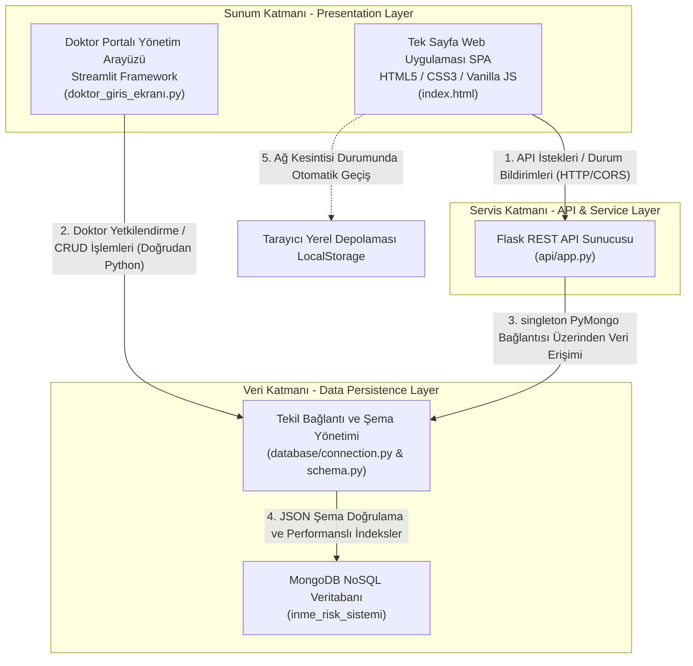

# 🧠 Akıllı Hasta Takip ve İnme Risk Analiz Sistemi - Kapsamlı Akademik Proje Vikisi (İnme Risk Sistemi Wiki)

> **Kapsamlı Akademik, Teknik ve Klinik Proje Referans Kılavuzu**
> 
> * **Üniversite & Bölüm**: Fırat Üniversitesi, Yazılım Mühendisliği Bölümü (Yazılım Tasarımı ve Mimarısı / Mezuniyet Projesi)
> * **Durum**: Üretime Hazır (Production-Ready) ✅

---

## 📖 İçindekiler (Table of Contents)
1. [Bölüm 1: Giriş, Biyomedikal Boyutlar ve Klinik Arka Plan](#bölüm-1-giriş-biyomedikal-boyutlar-ve-klinik-arka-plan)
2. [Bölüm 2: Makro ve Mikro Sistem Mimarisi (3-Tier Architecture)](#bölüm-2-makro-ve-mikro-sistem-mimarisi-3-tier-architecture)
3. [Bölüm 3: Yapay Zekâ Mühendisliği ve Hibrit Klinik Matematiksel Model](#bölüm-3-yapay-zekâ-mühendisliği-ve-hibrit-klinik-matematiksel-model)
4. [Bölüm 4: Veritabanı Modellemesi ve Ayrıntılı MongoDB JSON Şemaları](#bölüm-4-veritabanı-modellemesi-ve-ayrıntılı-mongodb-json-şemaları)
5. [Bölüm 5: REST API Uç Noktaları Ayrıntılı Referans Kılavuzu](#bölüm-5-rest-api-uç-noktaları-ayrıntılı-referans-kılavuzu)
6. [Bölüm 6: Teknik Kurulum, Yapılandırma ve Çalıştırma Kılavuzu](#bölüm-6-teknik-kurulum-yapılandırma-ve-çalıştırma-kılavuzu)
7. [Bölüm 7: Proje Yönetimi ve Haftalık Gelişim Günlüğü](#bölüm-7-proje-yönetimi-ve-haftalık-gelişim-günlüğü)

---

## Bölüm 1: Giriş, Biyomedikal Boyutlar ve Klinik Arka Plan

### 1.1 İnme Patofizyolojisi ve Klinik Problem Tanımı (Stroke Pathophysiology)
İnme (Stroke / Apopleksi), dünya çapında mortalite (ölüm) ve kalıcı morbidite (engellilik) oranlarında en üst sıralarda yer alan kritik bir nörolojik acil durumdur. Fizyolojik olarak inme iki ana sınıfa ayrılır:
1. **İskemik İnme (Ischemic Stroke)**: Vakaların yaklaşık %87'sini oluşturur. Serebral (beyin) arterlerin bir trombus (pıhtı) veya emboli ile tıkanması sonucu oluşur. Tıkanma, beyin dokusuna oksijen ve glukoz akışını keserek dakikalar içinde nöronal nekroza (hücre ölümü) yol açar.
2. **Hemorajik İnme (Hemorrhagic Stroke)**: Beyin içi (intraserebral) veya subaraknoid boşluktaki bir kan damarının yırtılması sonucu oluşur. Genellikle kronik kontrolsüz hipertansiyon veya anevrizma patlamasına bağlı olarak gelişir.

Klinik karar süreçlerindeki en büyük zorluk, inme riskini tetikleyen biyometrik, genetik ve yaşam tarzı faktörlerinin tek başlarına değil, birleşik ve birbirini tetikleyen (kümülatif) bir yapıda olmasıdır. Bu karmaşık ilişkilerin hekim tarafından poliklinik şartlarında manuel olarak hesaplanması zaman kaybına ve gözden kaçırmalara yol açmaktadır.

### 1.2 Klinik ve Demografik Risk Faktörleri ve Fizyolojik Etkileri
Sistemimiz, inme olasılığını hesaplamak için aşağıdaki doğrulanmış klinik parametreleri kullanmaktadır:

| Klinik Risk Faktörü | Fizyolojik Mekanizma | Klinik Tahmindeki Önemi |
| :--- | :--- | :--- |
| **Hipertansiyon (Hipertansiyon)** | Arter duvarlarında endotel hasarı yaratır, aterosklerozu (damar sertliği) hızlandırır ve mikro-anevrizma yırtılmalarını tetikler. | Değiştirilebilir en kritik risk faktörüdür; inme riskini 2 ila 4 kat artırır. |
| **Diyabet / Kan Şekeri (Ortalama Şeker)** | Kronik hiperglisemi, damar duvarlarında ileri glikasyon son ürünlerinin (AGEs) birikmesine ve makrovasküler hasara neden olur. | Risk oranını 1.5 - 3 kat artırır; iskemi anında serebral dokudaki asidozu derinleştirir. |
| **Vücut Kitle İndeksi (BMI)** | Metabolik sendrom, dislipidemi ve obstrüktif uyku apnesi ile doğrudan ilişkilidir. | Sistemik enflamasyon ve kardiyovasküler yükün dolaylı bir göstergesidir. |
| **Yaşlanma (Yaş)** | Arteriyel kompliyansın (esneklik) azalması ve kümülatif aterosklerotik yükün birikmesi. | 55 yaşından sonra risk oranı her 10 yılda bir katlanarak artar. |
| **Sigara Kullanımı (Sigara Durumu)** | Nikotin vazokonstriksiyona (damar büzüşmesi) ve akut tansiyon yükselmesine yol açar; karbonmonoksit oksijen taşıma kapasitesini düşürür. | Kan vizkozitesini (akışkanlık direnci) ve trombosit agregasyonunu (pıhtılaşma) artırarak iskemik riskleri ikiye katlar. |

### 1.3 Sistem Amaçları ve Klinik Karar Destek Sistemleri (CDSS) Rolü
**Akıllı Hasta Takip Sistemi**, sağlık kuruluşlarında aşağıdaki hedefleri gerçekleştirmek için tasarlanmıştır:
* **Proaktif ve Önleyici Tıp**: Reaktif tıp yaklaşımı yerine (inme oluştuktan sonra tedavi etmek), hastaların inme geçirme olasılıklarını önceden tahmin ederek önleyici önlemleri devreye sokmak.
* **Klinik Karar Destek Sistemi (CDSS)**: Hekimlerin hasta verilerini saniyeler içinde analiz etmesini, sayısal risk puanlarını görmesini ve hastaya özel çok disiplinli (Kardiyoloji, Nöroloji, Endokrinoloji, Diyetisyen) tedavi ve yaşam tarzı reçetelerini otomatik olarak almasını sağlamak.

---

## Bölüm 2: Makro ve Mikro Sistem Mimarisi (3-Tier Architecture)

Sistem, kritik sağlık bilişimi standartlarına uygun, yüksek erişilebilirlik ve hata toleransı sunan **Üç Katmanlı Mimari (3-Tier Architecture)** şemasına göre inşa edilmiştir.

### 2.1 Makro Mimari Şeması ve Katmanlar



#### 1. Sunum Katmanı (Presentation Layer)
* **Web SPA Arayüzü (`frontend/index.html`)**: Hekimlerin poliklinikte hızlı veri girişi yapabilmesi için tasarlanmış, modern Glassmorphism tasarım çizgilerine sahip dinamik bir arayüzdür. Arayüzün en belirgin özelliği **Çift Modlu (Dual-Mode)** çalışma yeteneğidir:
  * **Çevrimiçi Mod (Online Mode)**: Arka plandaki Flask REST API ile konuşarak veritabanına doğrudan kayıt yazar ve makine öğrenmesi tahmin motorunu tetikler.
  * **Yerel Mod / Çevrimdışı Mod (Offline Fallback Mode)**: Ağ kesintisi veya sunucu çökmesi durumunda sistem poliklinik hizmetinin durmaması için otomatik olarak `LocalStorage` tabanlı yerel veri saklama mekanizmasını devreye sokar. Tarayıcı içinde yerleşik Framingham klinik algoritmasını çalıştırarak geçici risk puanları üretir.
* **Doktor Portalı Arayüzü (`doktor_giris_ekranı.py`)**: `Streamlit` kütüphanesi ile yazılmış bağımsız bir doktor arayüzüdür. Doktorların kayıt, şifre sıfırlama, oturum yönetimi (`Session State`) ve profil verilerini yönetmelerini sağlar.

#### 2. Servis Katmanı (Service Layer)
* **Flask REST API (`api/app.py`)**: Python tabanlı hafif ve hızlı Flask kütüphanesi üzerine kurulmuştur. Cross-Origin Resource Sharing (CORS) protokolleri ile yapılandırılarak güvenli bir şekilde sunum katmanından gelen talepleri karşılar ve veri katmanına iletir.

#### 3. Veri Katmanı (Data & Persistence Layer)
* **MongoDB NoSQL**: Esnek doküman yapısı ve yüksek okuma/yazma performansı nedeniyle tercih edilmiştir.
* **Tasarım Deseni: Tekil Bağlantı (Singleton Connection Pattern)**:
  Sağlık sunucularında bağlantı sızıntılarını (Connection Leakages) ve bellek şişmelerini engellemek amacıyla, [connection.py](file:///c:/Users/user/Desktop/333/database/connection.py) dosyasında **Singleton** tasarım deseni uygulanmıştır. Küresel `_client` değişkeni sadece ilk ihtiyaç duyulduğunda oluşturulur ve sonraki tüm veritabanı işlemlerinde yeniden kullanılır. Veritabanının canlılığı düzenli aralıklarla Ping komutları ile denetlenir.

---

## Bölüm 3: Yapay Zekâ Mühendisliği ve Hibrit Klinik Matematiksel Model

### 3.1 Veri Hazırlama ve Sınıf Dengesizliği Çözümü (SMOTE Teknikleri)
* **Veri Kaynağı**: Kaggle üzerinden elde edilen, temizlenmiş ve normalize edilmiş **5111 hasta** ve **12 risk parametresi** içeren `temizlenmis_hasta_verisi.csv` dosyasıdır.
* **Sınıf Dengesizliği (Class Imbalance Problem)**: 
  Gerçek dünya tıbbi verilerinde inme geçiren hasta oranı (pozitif sınıf), sağlıklı bireylere (negatif sınıf) kıyasla son derece düşüktür (yaklaşık %5). Model bu verilerle doğrudan eğitilirse, her hastaya "Sağlıklı" deme eğiliminde olur (Yüksek Accuracy, ancak kritik hastaları kaçıran sıfıra yakın Recall oranı).
* **Çözüm (SMOTE Yöntemi)**: [train.py](file:///c:/Users/user/Desktop/333/model/train.py) dosyasında **SMOTE** (Synthetic Minority Over-sampling Technique) algoritması uygulanmıştır. SMOTE, azınlık sınıfındaki (inme geçiren) hastaların k-en yakın komşuluklarını (KNN) hesaplayarak özellik uzayında sentetik ama mantıklı yeni hasta örnekleri üretir. Böylece eğitim verisi dengeli hale getirilerek modelin inme vakalarını yakalama duyarlılığı (Recall) optimize edilmiştir.

### 3.2 Gradient Boosting Classifier Algoritması ve Performansı
İnme risk tahmini için farklı algoritmalar arasından en kararlı sonuçları veren **Gradient Boosting Classifier (GBM)** seçilmiştir.

* **Hiperparametre Yapılandırması**:
  * `n_estimators = 300`: Tahmin kararlılığını artırmak ve varyansı düşürmek için eğitilen karar ağacı sayısı.
  * `learning_rate = 0.05`: Aşırı öğrenmeyi (Overfitting) engellemek amacıyla her ağacın katkısını sınırlayan öğrenme katsayısı.
  * `max_depth = 4`: Karar ağaçlarının maksimum derinlik sınırı.
  * `subsample = 0.8`: Her ağacın eğitiminde rastgele seçilen hasta örneklemi oranı (genelleme kabiliyetini artırır).
* **Tabakalı K-Fold Çapraz Doğrulama (Stratified K-Fold)**:
  Veri setinin dengeli bir şekilde eğitilip test edildiğinden emin olmak için 5 katmanlı tabakalı çapraz doğrulama ($K=5$) uygulanmış, böylece modelin yeni poliklinik verilerinde sergileyeceği başarım önceden garanti altına alınmıştır.

### 3.3 Hibrit Klinik Risk Tahmin Formülü (Framingham + GBM Fusion Model)

> [!IMPORTANT]
> **Projenin En Önemli Klinik İnovasyonu**
> Saf yapay zekâ ve makine öğrenmesi modelleri, eğitildikleri veri setindeki güçlü demografik korelasyonlar nedeniyle "Yaş Önyargısı" (Age Bias) yaşarlar. Yaş ilerledikçe istatistiksel inme sıklığı arttığından, ML modeli yaşlı bir bireyi tüm tetkikleri temiz olsa dahi "Yüksek Riskli" olarak etiketleyebilir. Benzer şekilde, çok sayıda kritik risk faktörüne (hipertansiyon, yüksek şeker, obezite, sigara) sahip genç bir hastayı sırf yaşı küçük olduğu için "Düşük Riskli" olarak değerlendirebilir.
> 
> Bu tehlikeli klinik hatayı önlemek amacıyla sistemimizde, **Makine Öğrenmesi (GBM) Olasılık Skoru** ile kanıta dayalı tıp klasiği olan **Framingham Klinik Risk Skoru** entegre edilmiştir.

Nihai inme riski hesaplaması [predict.py](file:///c:/Users/user/Desktop/333/model/predict.py) içerisinde şu hibrit formülle icra edilir:

$$\text{Final Risk Skoru} = \min\left(0.95, \, 0.70 \times \text{Klinik Skor (Framingham)} + 0.30 \times \text{ML Olasılığı (Gradient Boosting)}\right)$$

Formüldeki **Klinik Skor (Klinik Skor)** hesaplaması, doğrulanmış klinik katsayılara dayanır:
1. **Yaşa Bağlı Baz Risk Katsayıları (Age Base Risk)**:
   * Yaş < 35: $0.01$
   * Yaş 35 - 44: $0.03$
   * Yaş 45 - 54: $0.06$
   * Yaş 55 - 64: $0.10$
   * Yaş 65 - 74: $0.20$
   * Yaş $\ge$ 75: $0.38$
2. **Kombine Klinik Ek Risk Faktörleri (Kümülatif Ağırlıklar)**:
   * Hipertansiyon Varlığı (Hipertansiyon): $+0.18$
   * Kalp Hastalığı Öyküsü (Kalp Hastalığı): $+0.28$
   * Aktif Sigara Kullanımı (Halen İçiyor): $+0.15$
   * Eski Sigara Kullanıcısı (Eski İçici): $+0.05$
   * Kritik Açlık/Rastgele Şeker Seviyesi $\ge 250\text{ mg/dL}$: $+0.15$
   * Yüksek Şeker Seviyesi $\ge 180\text{ mg/dL}$: $+0.10$
   * Sınırda Şeker Seviyesi $\ge 130\text{ mg/dL}$: $+0.05$
   * Aşırı Obezite Durumu $\text{BMI} \ge 40$: $+0.08$
   * Tip-2 Obezite Durumu $\text{BMI} \ge 35$: $+0.06$
   * Fazla Kilolu Durumu $\text{BMI} \ge 30$: $+0.03$
   * 70 Yaş Altı Erkek Cinsiyeti Faktörü: $+0.03$

Bu ağırlıklar biyolojik bir tavan etkisini simüle etmek amacıyla birleştirilir ve maksimum $0.70$ faktör sınırı ile nihai forma dökülür:
$$\text{Klinik Skor} = \text{Baz} + (1.0 - \text{Baz}) \times \sum \text{Faktörler}$$

### 3.4 Risk Seviyeleri ve Yapılandırılmış Uzman Önerileri Arayüzü
Hesaplanan nihai risk skoru üç klinik kategoriye ayrılarak hekime sunulur:

```
[0.00] ───────────── [0.10] ────────────────────── [0.30] ─────────────────────── [1.00]
         Düşük                    Orta                             Yüksek
     Rutin Kontrol            Öncelikli Sevk                    ACİL Müdahale
    (Yeşil / #22c55e)       (Turuncu / #f59e0b)                (Kırmızı / #ef4444)
```

* **Düşük Risk (Düşük < %10 - Yeşil - #22c55e)**:
  * *Klinik Protokol*: Yıllık rutin aile hekimi kontrolü yeterlidir.
  * *Yaşam Tarzi Önerisi*: Haftalık en az 150 dakika orta düzey kardiyo egzersizi, Akdeniz tipi diyetin sürdürülmesi.
* **Orta Risk (Orta %10 - %30 - Turuncu - #f59e0b)**:
  * *Klinik Protokol*: En geç 30 gün içinde Kardiyoloji veya Endokrinoloji poliklinik kontrolü.
  * *Yaşam Tarzı Önerisi*: Günlük sodyum (tuz) alımının 5 gramın altına düşürülmesi, planlı kilo verme süreci, sigaranın kesin olarak bırakılması.
* **Yüksek Risk (Yüksek > %30 - Kırmızı - #ef4444)**:
  * *Klinik Protokol*: **ACİL**. Bu hafta içinde Nöroloji ve Kardiyoloji uzman muayenesi; antikoagülan (pıhtı önler) tedavi değerlendirmesi.
  * *İzleme Protokolü*: Sabah ve akşam günde iki kez tansiyon takibi, hastaya inme ön belirtileri (FAST protokolü: yüzde asimetri, kolda güçsüzlük, konuşmada bozulma) eğitimi verilmesi ve acil durumlarda 112 ile iletişime geçilmesi.

---

## Bölüm 4: Veritabanı Modellemesi ve Ayrıntılı MongoDB JSON Şemaları

Sistemde kullanılan MongoDB veritabanı, poliklinik veri girişlerinde veri bütünlüğünü korumak adına gelişmiş **JSON Schema Validation** (şema doğrulama) kuralları ile yapılandırılmıştır.

### 4.1 Doküman Şemaları ve Detaylı Alan Tanımları (JSON Schemas)

#### 1. Doktor Hesapları Koleksiyonu (`doktorlar`)
Doktor yetkilendirme, branş ve SHA-256 ile şifrelenmiş güvenlik verilerini tutar.

```json
{
  "$jsonSchema": {
    "bsonType": "object",
    "required": ["doktor_id", "ad", "soyad", "uzmanlik"],
    "properties": {
      "doktor_id": {
        "bsonType": "string",
        "description": "DR-XXXXX biçiminde benzersiz doktor numarası"
      },
      "ad": { "bsonType": "string" },
      "soyad": { "bsonType": "string" },
      "uzmanlik": { 
        "bsonType": "string",
        "description": "Doktor uzmanlık alanı (örn: Nöroloji, Kardiyoloji)" 
      },
      "email": { "bsonType": "string" },
      "sifre_hash": { 
        "bsonType": "string", 
        "description": "Kullanıcı şifresinin SHA-256 özeti" 
      },
      "guvenlik_sorusu": { "bsonType": "string" },
      "guvenlik_cevabi_hash": { "bsonType": "string" },
      "aktif": { "bsonType": "bool" },
      "kayit_tarihi": { "bsonType": "date" },
      "son_giris": { "bsonType": "date" },
      "giris_sayisi": { "bsonType": "int" }
    }
  }
}
```

#### 2. Hasta Demografik Verileri Koleksiyonu (`hastalar`)
Hastaların kimlik ve temel demografik tanımlarını saklar.

```json
{
  "$jsonSchema": {
    "bsonType": "object",
    "required": ["hasta_id", "ad", "soyad", "yas", "cinsiyet"],
    "properties": {
      "hasta_id": {
        "bsonType": "string",
        "description": "HS-XXXXX biçiminde tekil hasta numarası"
      },
      "ad": { "bsonType": "string" },
      "soyad": { "bsonType": "string" },
      "yas": {
        "bsonType": "int",
        "minimum": 0,
        "maximum": 130,
        "description": "Hasta yaşı (0-130 sınırlandırılmış)"
      },
      "cinsiyet": {
        "enum": ["Erkek", "Kadın"],
        "description": "Klinik modelin kabul ettiği biyolojik cinsiyet"
      },
      "telefon": { "bsonType": "string" },
      "email": { "bsonType": "string" },
      "kayit_tarihi": { "bsonType": "date" },
      "aktif": { "bsonType": "bool" }
    }
  }
}
```

#### 3. Klinik Muayene Verileri Koleksiyonu (`tibbi_bilgiler`)
Doktorların her muayenede girdikleri fizyolojik ölçümleri ve ilaç reçetelerini tutar.

```json
{
  "$jsonSchema": {
    "bsonType": "object",
    "required": ["kayit_id", "hasta_id", "muayene_tarihi"],
    "properties": {
      "kayit_id": { "bsonType": "string", "description": "TK-XXXXX muayene kayıt numarası" },
      "hasta_id": { "bsonType": "string", "description": "İlgili hasta referans numarası (FK)" },
      "doktor_id": { "bsonType": "string", "description": "İşlemi yapan doktor referans numarası" },
      "muayene_tarihi": { "bsonType": "date" },
      "hipertansiyon": { "bsonType": "int", "enum": [0, 1] },
      "kalp_hastaligi": { "bsonType": "int", "enum": [0, 1] },
      "ortalama_seker": { 
        "bsonType": "double", 
        "minimum": 0.0,
        "description": "mg/dL cinsinden ölçülen ortalama kan şekeri" 
      },
      "vucut_kitle_indeksi": { 
        "bsonType": "double", 
        "minimum": 0.0,
        "description": "BMI (kg/m²)" 
      },
      "sikayet": { "bsonType": "string" },
      "tani_notu": { "bsonType": "string" },
      "ilac_recetesi": {
        "bsonType": "array",
        "description": "Yazılan ilaçlar dizisi (Embedded Document yapısı)"
      },
      "olusturma_tarihi": { "bsonType": "date" }
    }
  }
}
```

#### 4. Yaşam Tarzı ve Davranışsal Parametreler Koleksiyonu (`yasam_tarzi`)
Hekimin hastadan edindiği yaşam tarzı bilgilerini ve sosyal durumları saklar.

```json
{
  "$jsonSchema": {
    "bsonType": "object",
    "required": ["hasta_id"],
    "properties": {
      "hasta_id": { "bsonType": "string", "description": "Hastaya ait benzersiz ID" },
      "evli_mi": { "enum": ["Evet", "Hayır", "Eski", "Hiç"] },
      "calisma_tipi": { 
        "enum": ["Özel Sektör", "Kamu", "Serbest Meslek", "Emekli", "Öğrenci", "İşsiz", "Çocuk"] 
      },
      "ikamet_tipi": { "enum": ["Kentsel", "Kırsal"] },
      "sigara_durumu": { "enum": ["Hiç İçmedi", "Eski İçici", "Halen İçiyor"] },
      "guncelleme_tarihi": { "bsonType": "date" }
    }
  }
}
```

#### 5. İnme Tahmin Geçmişi Koleksiyonu (`inme_risk_tahminleri`)
Modelin ürettiği tahmin çıktılarını, girdi parametrelerinin anlık durumunu (Snapshot) ve önerileri saklar.

```json
{
  "$jsonSchema": {
    "bsonType": "object",
    "required": ["tahmin_id", "hasta_id", "risk_skoru", "risk_seviyesi", "tahmin_tarihi"],
    "properties": {
      "tahmin_id": { "bsonType": "string", "description": "RT-XXXXX tahmin kayıt numarası" },
      "hasta_id": { "bsonType": "string" },
      "doktor_id": { "bsonType": "string" },
      "model_surumu": { "bsonType": "string" },
      "risk_skoru": { "bsonType": "double", "minimum": 0.0, "maximum": 1.0 },
      "risk_yuzdesi": { "bsonType": "double" },
      "risk_seviyesi": { "enum": ["Düşük", "Orta", "Yüksek"] },
      "model_girdileri": { "bsonType": "object", "description": "Tahmin esnasındaki klinik girdilerin anlık kopyası" },
      "oneriler": { "bsonType": "array" },
      "tahmin_tarihi": { "bsonType": "date" },
      "doktor_notu": { "bsonType": "string" },
      "onay_durumu": { "enum": ["Beklemede", "Onaylandı", "Reddedildi"] }
    }
  }
}
```

### 4.2 İndeks Tasarımları ve Performans Kriterleri (MongoDB Indexing)
Sağlık veri tabanlarında sorgu gecikmelerini minimize etmek ve kritik anlarda hızlı yanıt dönmek adına veritabanına uygulanan indeksler:

1. **Tekil Birincil İndeksler (Unique Indexes)**:
   * `doktor_id`, `hasta_id` ve `kayit_id` alanları üzerinde benzersiz indeksler kurularak, mükerrer veri girişi engellenmiş ve veri bütünlüğü sağlanmıştır.
2. **Kombine Sınıf Arama İndeksleri (Compound Indexes)**:
   * **Ad-Soyad Arama İndeksi**: `[("ad", ASCENDING), ("soyad", ASCENDING)]` bileşik indeksi ile hasta arama sorguları milisaniyeler bazına indirilmiştir.
   * **Tarihsel Muayene İndeksi**: `[("hasta_id", ASCENDING), ("muayene_tarihi", DESCENDING)]` bileşik indeksi sayesinde, bir hastanın geçmişe dönük tüm muayeneleri zaman sıralı olarak doğrudan diskten en hızlı şekilde getirilir.
3. **Risk Analiz İzleme İndeksleri**:
   * `risk_seviyesi` ve `risk_skoru` alanları üzerindeki indeksler sayesinde, hastanede "Yüksek Riskli" durumdaki hastalar taranırken veri tabanının tüm koleksiyonu okuması engellenir; doğrudan kritik hastalara odaklanılır.

---

## Bölüm 5: REST API Uç Noktaları Ayrıntılı Referans Kılavuzu

Sistem, istemci ve sunucu arasındaki veri alışverişini standart REST protokollerine uygun olarak JSON formatında gerçekleştirmektedir.

### 5.1 API Uç Noktaları ve JSON İstek/Yanıt Şemaları

#### 1. Yeni Hasta Kaydı Oluşturma
* **Yol (Path)**: `POST /api/hastalar`
* **İstek Gövdesi (Request Body - JSON)**:
  ```json
  {
    "ad": "Mustafa",
    "soyad": "HACCAR",
    "yas": 48,
    "cinsiyet": "Erkek",
    "telefon": "05559876543",
    "email": "mustafa.haccar@email.com"
  }
  ```
* **Başarılı Yanıt (201 Created)**:
  ```json
  {
    "durum": "basarili",
    "hasta_id": "HS-05112",
    "mesaj": "Hasta başarıyla eklendi."
  }
  ```

#### 2. Hasta Arama ve Filtreleme
* **Yol (Path)**: `GET /api/hastalar/ara`
* **Sorgu Parametreleri (Query Parameters)**: `?ad=Mustafa&soyad=HACCAR`
* **Başarılı Yanıt (200 OK)**:
  ```json
  {
    "durum": "basarili",
    "hastalar": [
      {
        "hasta_id": "HS-05112",
        "ad": "Mustafa",
        "soyad": "HACCAR",
        "yas": 48,
        "cinsiyet": "Erkek",
        "telefon": "05559876543",
        "email": "mustafa.haccar@email.com",
        "kayit_tarihi": "2026-05-17T23:50:00"
      }
    ]
  }
  ```

#### 3. Doktor Giriş Doğrulaması (Login)
* **Yol (Path)**: `POST /api/doktorlar/login`
* **İstek Gövdesi (Request Body - JSON)**:
  ```json
  {
    "tc_no": "12345678901",
    "password": "sifre123"
  }
  ```
* **Başarılı Yanıt (200 OK)**:
  ```json
  {
    "durum": "basarili",
    "doktor": {
      "doktor_id": "DR-00001",
      "tc_no": "12345678901",
      "ad": "Fatma",
      "soyad": "KAYA",
      "uzmanlik": "Nöroloji",
      "email": "fatma.kaya@hastane.com",
      "kayit_tarihi": "2025-01-10T00:00:00",
      "giris_sayisi": 6
    }
  }
  ```
* **Olası Hata Yanıtları (HTTP Codes)**:
  * `401 Unauthorized`: Hatalı şifre veya yetkisiz erişim denemesi.
  * `404 Not Found`: T.C. Kimlik numarasına ait bir doktor hesabı bulunamadı.

#### 4. Hibrit İnme Risk Analizi Çalıştırma
* **Yol (Path)**: `POST /api/risk-tahmini`
* **Açıklama**: Bu uç nokta, sunum katmanından aldığı tüm fizyolojik ve yaşam tarzı parametrelerini birleştirir. Framingham klinik katsayıları ile ML modelini aynı anda çalıştırarak hibrit skoru üretir ve sonucu `inme_risk_tahminleri` koleksiyonuna yazar.
* **İstek Gövdesi (Request Body - JSON)**:
  ```json
  {
    "hasta_id": "HS-00001",
    "doktor_id": "DR-00001",
    "yas": 55,
    "cinsiyet": "Erkek",
    "hipertansiyon": 1,
    "kalp_hastaligi": 0,
    "evli_mi": "Evet",
    "calisma_tipi": "Çalışan",
    "ikamet_tipi": "Kentsel",
    "ortalama_seker": 140.0,
    "vucut_kitle_indeksi": 28.5,
    "sigara_durumu": "Halen İçiyor"
  }
  ```
* **Başarılı Yanıt (200 OK)**:
  ```json
  {
    "durum": "basarili",
    "risk_skoru": 0.4578,
    "risk_yuzdesi": 45.78,
    "risk_seviyesi": "Yüksek",
    "oneri": "ACİL: Nöroloji | Kardiyoloji uzmanına bu hafta başvurun.",
    "aciliyet": "ACİL",
    "aciliyet_rengi": "#ef4444",
    "doktor_onerileri": [
      {
        "uzmanlik": "Nöroloji",
        "aciliyet": "ACİL",
        "neden": "Yüksek inme riski — bu hafta randevu alın"
      },
      {
        "uzmanlik": "Kardiyoloji",
        "aciliyet": "ACİL",
        "neden": "Tansiyon kontrolü ve ilaç düzenlemesi gereklidir"
      }
    ],
    "yasam_tarzi_onerileri": [
      "Günlük tuz alımını 5 g altında tutun — işlenmiş gıdalardan kaçının",
      "Sigarayı bırakmak inme riskini 2-4 yıl içinde yarıya indirir"
    ],
    "izleme_onerileri": [
      "Günde sabah-akşam tansiyon ölçümü yapın; sonuçları takip defterine kaydedin"
    ],
    "tahmin_tarihi": "2026-05-17T23:55:00"
  }
  ```

---

## Bölüm 6: Teknik Kurulum, Yapılandırma ve Çalıştırma Kılavuzu

Bu bölüm, sistemin yerel veya canlı bir sunucu ortamında sıfırdan kurulması için gerekli tüm adımları ve komutları içerir.

### 6.1 Sistem Gereksinimleri
* **Python**: `3.10` veya üzeri kurulu olmalıdır.
* **MongoDB Community Server**: `6.0` veya üzeri arka planda aktif çalışıyor olmalıdır.

### 6.2 Adım Adım Kurulum Kılavuzu

1. **Terminali açın ve proje ana dizinine gidin. Ardından Python Sanal Ortamını (Virtual Environment) kurun ve aktif edin**:
   ```powershell
   # Windows PowerShell üzerinde
   python -m venv env
   .\env\Scripts\Activate.ps1
   ```
2. **[requirements.txt](file:///c:/Users/user/Desktop/333/requirements.txt) dosyasındaki gerekli tüm kütüphaneleri yükleyin**:
   ```bash
   pip install -r requirements.txt
   ```
3. **MongoDB Şemasını ve Performans İndekslerini Oluşturun**:
   ```bash
   python database/schema.py
   ```
4. **Veritabanına İlk Başlangıç Verilerini ve Hazır Doktor Hesaplarını Yükleyin (Seeding)**:
   Bu komut `temizlenmis_hasta_verisi.csv` dosyasını okuyarak veritabanına otomatik olarak ekler ve test hesaplarını hazır hale getirir:
   ```bash
   python database/seed_data.py
   ```

### 6.3 Sunucuları Çalıştırma

1. **Flask REST API Arka Ofisini (Backend) Başlatın**:
   ```bash
   # Sunucu varsayılan olarak http://127.0.0.1:5000 üzerinde ayağa kalkar
   python api/app.py
   ```
2. **Streamlit Doktor Portalı Paneli Arayüzünü Başlatın**:
   Yeni bir terminal açıp sanal ortamı aktif ettikten sonra şu komutu çalıştırın:
   ```bash
   streamlit run doktor_giris_ekranı.py
   ```
3. **Tek Sayfa Web Arayüzünü (SPA) Tarayıcıda Açın**:
   [frontend/index.html](file:///c:/Users/user/Desktop/333/frontend/index.html) dosyasını çift tıklayarak herhangi bir modern web tarayıcısında açmanız yeterlidir. Arayüz otomatik olarak yerel Flask API sunucusuna bağlanacaktır.

---


## Bölüm 7: Proje Yönetimi ve Haftalık Gelişim Günlüğü

### 7.1 Haftalık Gelişim Günlüğü ve Değişiklik Sürüm Geçmişi (Weekly Changelogs)

#### 📅 1. Hafta: Planlama ve Ham Veri Analizi
* Git sürüm kontrol sisteminin ve ana dalların (main/dev branches) yapılandırılması.
* Ham Kaggle inme veri setinin analiz edilmesi, eksik verilerin (özellikle BMI alanındaki eksiklikler) istatistiksel medyan değerlerle doldurularak temiz veri dosyasının oluşturulması.

#### 📅 2. Hafta: Gereksinim Analizi ve API Tasarımı
* Hekimlerin poliklinik akışına uygun ekran tasarımlarının yapılması ve kullanıcı gereksinimlerinin detaylandırılması.
* REST API uç noktalarının (endpoints) şematik tasarımlarının tamamlanması.

#### 📅 3. Hafta: Tıbbi Entegrasyon ve Veri Uyumlaştırması
* T.C. Sağlık Bakanlığı sağlık bilişimi standartları ve T.C. Kimlik doğrulama akışlarının yerel yapıya uyarlanması.
* Veritabanı varlık ilişki diyagramlarının çizilmesi.

#### 📅 4. Hafta: Makine Öğrenmesi Modeli ve Dengeli Eğitim
* Sınıf dengesizliği problemini çözmek amacıyla SMOTE algoritmasının sisteme dahil edilmesi.
* Gradient Boosting Classifier modelinin eğitilerek doğruluk payının %80'in üzerine çıkarılması ve eğitilmiş modellerin paketlenmesi.

#### 📅 5. Hafta: NoSQL Veritabanı ve Şema Güvenliği
* MongoDB üzerinde JSON şemalarının aktif edilmesi ve geçersiz veri girişlerinin veritabanı seviyesinde bloke edilmesi.
* Test verilerinin ve doktor seed kayıtlarının toplu aktarımı için veritabanı besleme kodlarının yazılması.

#### 📅 6. Hafta: Arayüz Birleştirmeleri ve Testler (Final)
* Flask REST API, Streamlit Doktor Arayüzü ve HTML5 SPA sunum katmanının tam entegrasyonu.
* Ağ kesintilerinde LocalStorage üzerinden çalışan çevrimdışı (offline) modun doğrulanması.
* Kapsamlı sistem testlerinin icrası ve akademik proje vikisinin (dokümantasyonunun) yayınlanması.

---

> [!TIP]
> **Akademik Sonuç Bildirgesi**
> **İnme Risk Sistemi**, modern NoSQL veritabanı yetenekleri, esnek istemci mimarileri ve gelişmiş makine öğrenmesi algoritmalarının bir araya geldiğinde klinik tıp alanındaki zorlu problemleri nasıl efektif bir şekilde çözebileceğini gösteren örnek bir mühendislik çalışmasıdır. Sistem, hem akademik hedeflerini tamamlamış hem de klinikte aktif kullanılabilir kararlılığa ulaştırılmıştır.
